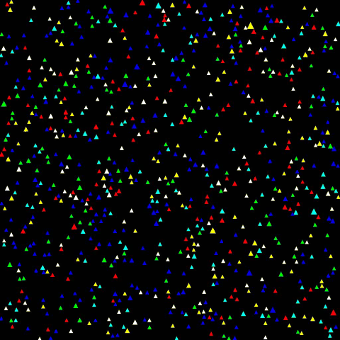
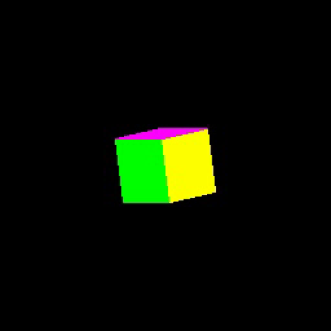
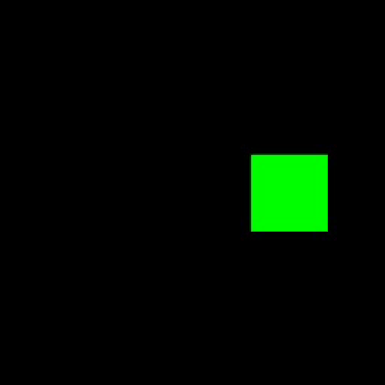
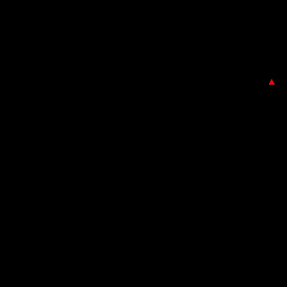
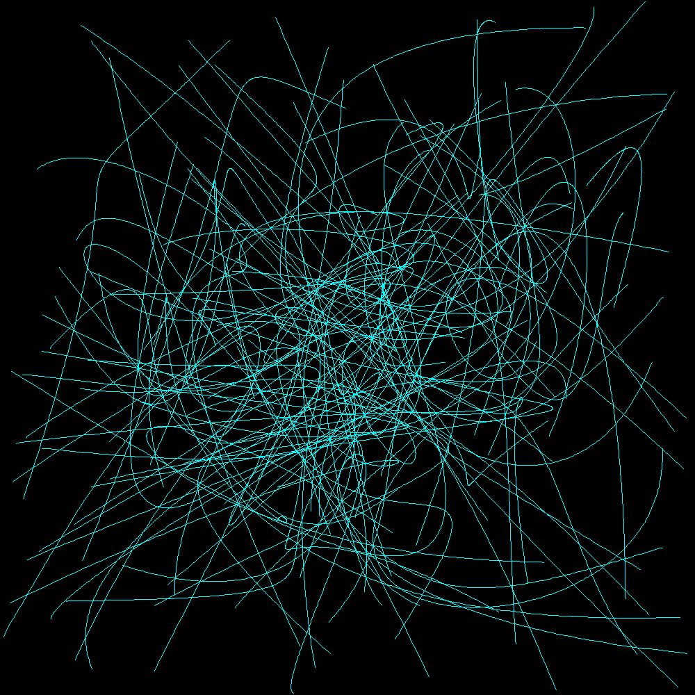
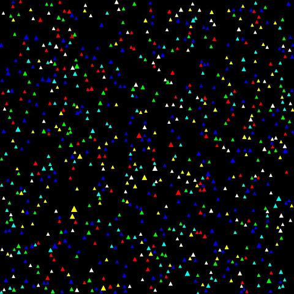

# Java Software Renderer: Emergent Parasite Simulation



A complete 2D/3D graphics pipeline built from scratch in Java, with no OpenGL and no hardware acceleration. Every pixel in every frame is computed by hand through math, rasterization, and shading code written for this project.

The final piece is an **agent-based parasite simulation**. Hundreds of parasites travel along procedurally generated paths, collide, and consume one another. No central controller decides the outcome. The population dynamics emerge from simple local rules, producing an ambient, ever-changing visual that works as a screensaver or animated background.

---

## Why I Built This

This started as the semester-long project for my Computer Graphics course (CSC405) and grew into one of the largest projects I have built. Instead of calling a graphics library, I had to implement each stage myself, which taught me how rendering actually works under the hood:

- **Linear algebra in practice.** Vectors and matrices stopped being abstract. Every rotation, translation, and scale is a matrix multiplication I wrote and debugged.
- **Rasterization.** Turning a mathematical triangle into actual pixels exposed edge cases, aliasing, and off-by-one errors that GPUs normally hide.
- **Shading and color.** Representing color explicitly and interpolating it across geometry made gradients and fills a concrete problem rather than a setting.
- **Systems design.** Keeping math, geometry, shading, and output as separate layers made it possible to build a full simulation on top without rewriting the core.

For the final project, I chose a particle simulation rather than a static scene. The goal was something visually engaging that could run on its own as a background, while still putting every part of the pipeline to work.

---

## Pipeline Overview

```
Math → Geometry → Rasterization → Shading → Scene → Simulation → Frames → Video → GIF
```

Each stage is implemented explicitly in its own set of classes.

---

## 1. Mathematical Foundations

**Vectors and matrices** (`Vector`, `VectorAbstract`, `Matrix`, `MatrixAbstract`)
Vectors represent positions, directions, and interpolated values. Matrices encode linear transformations so spatial operations can be composed cleanly.

**Affine transformations** (`AffineTransformation`, `AffineTransformationAbstract`)
Translation, rotation, and scaling are modeled as affine matrices, which allows transformations to be chained while keeping coordinate spaces consistent.



**Curves, complex numbers, and fractals** (`BezierCurve`, `Curves`, `ComplexNumber`, `Mandelbrot`)
These show that the pipeline can render mathematically defined structures, not only meshes. The Mandelbrot renderer stresses numerical iteration and color mapping.

---

## 2. Color and Shading

**Color representation** (`Color`, `ColorAbstract`)
Colors are stored explicitly as RGB values and interpolated across geometry for smooth fills and gradients.

**Shaders** (`Shader`, `ShaderAbstract`)
Shading logic is separated from geometry and rasterization, mirroring the programmable stages of a modern GPU pipeline.

---

## 3. Geometry and Rasterization

**Triangles as the core primitive** (`Triangle`, `TriangleAbstract`)
All filled geometry is broken down into triangles because they are always planar and easy to interpolate across.

**Scanline rasterization** (`ScanConvertLine`, `ScanConvertAbstract`)
Triangles are filled one horizontal row at a time:

1. Identify the triangle's edges
2. For each scanline, compute where it crosses those edges
3. Fill the horizontal span between the crossings pixel by pixel

---

## 4. 3D Models and Scenes

**STL parsing** (`STLParser`)
STL files are standard triangle-mesh formats used in 3D printing and CAD. They are parsed and rendered through the same pipeline as procedural geometry.




**Scene objects** (`SceneObject`, `SceneObjectAbstract`)
Scene objects bundle geometry, transformations, and shading behavior together so complex scenes stay manageable.

---

## 5. The Parasite Simulation

This is where every layer comes together. The main entry point is `src/Main/ParasiteSimulation.java`.

### Procedural paths

Each parasite gets its own unique path built by `Pathmaker`:

1. Generate 16 connected Bézier curve segments, each starting near where the last one ended, so the path flows smoothly
2. Sample each curve densely into points
3. **Resample the path by arc length** into exactly 600 evenly spaced steps

The resampling step matters. Raw Bézier sampling bunches points together on tight curves and spreads them out on straight sections, which would make parasites speed up and slow down unnaturally. Spacing points by actual distance traveled keeps motion at a constant speed.



Rendering many generated paths at once shows the variety `Pathmaker` produces. Every strand below is a separate parasite's route, built from chained Bézier segments:



### Collision detection

Each frame runs through the same loop:

1. **Update.** Every living parasite ticks its lifespan and advances one step along its path.
2. **Check collisions.** Every pair of living parasites is compared using a triangle intersection test (`Triangle.intersects`), since each parasite is drawn as a triangle.
3. **Resolve.** When two parasites overlap, a coin flip decides the winner. The winner grows, the loser dies and is removed.
4. **Prevent double counting.** Eliminated parasites are tracked in a set so a parasite that died earlier in the same frame cannot win or lose another collision.
5. **Render.** Surviving parasites are filled into the framebuffer by the shader, and the frame is written to disk as a PNG.

The simulation ends on its own once no parasites remain active.

### Performance choices

- **Off-screen culling** skips drawing parasites outside the visible frame.
- **Lifespans** retire parasites over time so the scene keeps evolving instead of stagnating.
- **Optional trails** draw each parasite's path history using Bresenham's line algorithm, useful for debugging motion.



With trails enabled across 1000 parasites, the paths themselves become the artwork: [view the 1000-path render](docs/media/Parasite_Simulation_1000_Paths_Shown.gif) (large file).

---

## 6. Frame Output and Video Tooling

Rendering happens off-screen into image buffers (`ReadWriteImage`), and each frame is saved as a numbered PNG. Python scripts in `tools/video_export` then turn those frames into video, keeping rendering and encoding as separate concerns.

| Script | Input frames | Output |
|---|---|---|
| `Fil1.py` | `frame000.png`, `frame001.png`, ... | Parasite simulation AVI |
| `cube_spin.py` | `orbiting_cube_1.png` to `orbiting_cube_150.png` | `cube_spin.avi` |
| `cube_spinner.py` | `colored_cube_1.png` to `colored_cube_37.png` | `cube_rotate.avi` (looped) |
| `make_gifs.py` | Every AVI in `tools/video_export/output` | Compressed GIFs in `docs/media` |

---

## Executable Experiments

Classes in `src/Tests` are visual experiments rather than unit tests. Each has its own `main` method and produces images you can inspect:

- `ShaderTest` for shading and fill styles
- `TestColorPalette` for color interpolation
- `CurvesTest` and `TestSinglePath` for parametric curves
- `TestPathmakerRender` for procedural path generation
- `MandelbrotTest` for fractal rendering
- `RandomWalk`, `CatRotator`, and `STLR` for focused visual demos
- `TestParasiteGame`, `TestParasiteDebugGame`, and `TestHundredParasites` for simulation variants

---

## How to Run

### Java renderer

1. Open the project in **IntelliJ IDEA** with JDK 17 or newer
2. Run any class with a `main` method in `src/Main` or `src/Tests`
3. For the full simulation, run `ParasiteSimulation` and wait for the frames to finish writing

### Video and GIF export

1. Create a Python virtual environment and install the dependencies:

   ```powershell
   python -m venv .venv
   .\.venv\Scripts\activate
   python -m pip install opencv-python pillow
   ```

2. Run the matching export script from `tools/video_export` (for example `Fil1.py` after the parasite simulation)
3. Run `make_gifs.py` to convert the videos into GIFs

Videos are written to `tools/video_export/output`, and GIFs are written to `docs/media`.

---

## Built With

- **Java** for the entire rendering pipeline and simulation, with no external graphics libraries
- **Python** with OpenCV and Pillow for video and GIF export